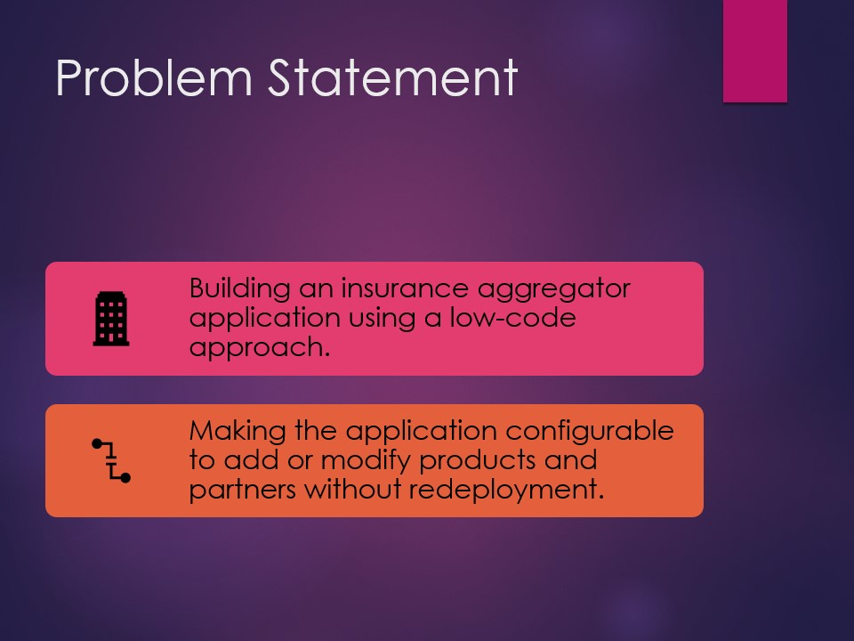
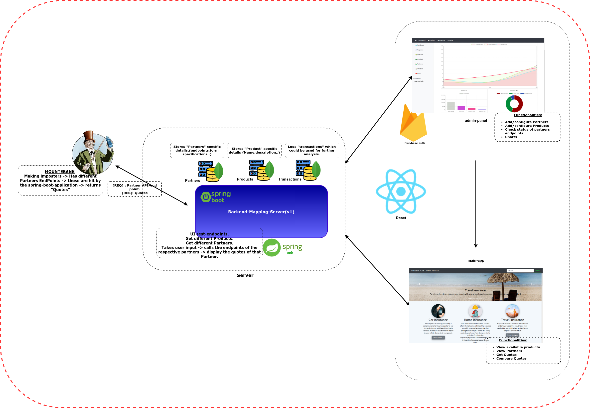

# GRAD PROJECT

**Problem Statement**: Building an Insurance Aggregator application.

## Description:  

  

## Overview:  

## Tech-Stack

Sample Insurance aggregator application uses **springboot** as backend, **React** for frontend. Features we demonstrate with this sample app.
- Dynamic form generation using config based approach.
- Setting up complete CI/CD workflow using github actions.
- Deployment to Azure kubernetes service.

| Category | Main tools used |
| ------ | ------ |
| Front-end |  React, Bootstrap, axios, chartjs, simple-chat-bot, npm|
| Back-end | Spring-boot, MongoDB, mockito, swagger, maven |
| Dev-ops | github actions, skaffold |
| Deployment | Azure Kubernetes Service, Azure container registry, ingress, docker |
|Serverless| Amplify|

